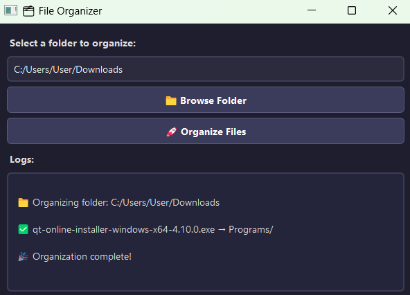

## 🐍 Python File Organizer

A simple Python automation tool that organizes your messy folders (like your Downloads folder) into neatly categorized subfolders — automatically! <br>
This project uses the built-in os and shutil modules to move files based on their extensions (images, documents, zips, programs, etc.).

---

## How It Works

1. The program reads every file in the target folder. <br>
2. It checks the file’s extension and matches it to a category. <br>
3. It automatically creates the necessary subfolders (if not already existing). <br>
4. Files are then moved to their respective folders using shutil.move(). <br>

---

## Usage

1. Clone the repo

```
git clone https://github.com/Allarezeroes26/File-Organizer.git
cd File-Organizer
```

2. Install Requirements
```
pip install -r requirements.txt
```

3. Run the program
```
python mainAuto.py
```

4. Enter folder Path

```
Enter path folder to organize: C:\Users\User\Downloads
```

---

## Screenshot




